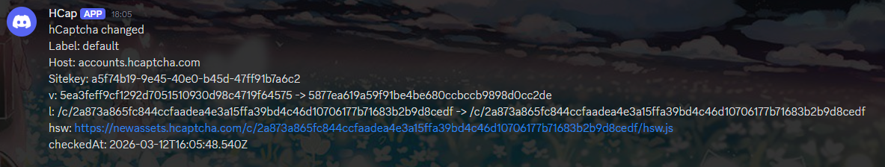

# hcaptcha-monitor



Small Docker service that monitors hCaptcha `v` and `hsw` path changes for one or more sitekeys.

The service stores the last seen value for each `host:sitekey` in a JSON file, polls on an interval, and sends a Discord webhook alert when the value changes.

## Requirements

- Docker, or
- Node.js 22+ if running locally

## Environment Variables

- `PORT`: HTTP port. Default: `3000`
- `POLL_INTERVAL_MS`: polling interval in milliseconds. Default: `600000`
- `CORS_ORIGIN`: allowed CORS origin. Default: `*`
- `STATE_FILE`: JSON file used to persist old values. Default: `/data/state.json`
- `DISCORD_WEBHOOK_URL`: optional Discord webhook for alerts
- `HCAP_TARGETS`: JSON array of targets
- `HCAP_SITEKEYS`: optional comma-separated fallback if `HCAP_TARGETS` is not set
- `TLS_DEBUG`: optional. Set to `1` to enable `node-tls-client` debug output

Recommended target format:

```json
[
  {
    "label": "default",
    "host": "accounts.hcaptcha.com",
    "sitekey": "a5f74b19-9e45-40e0-b45d-47ff91b7a6c2"
  }
]
```

## Local Run

Install dependencies:

```bash
npm install
```

Run one manual lookup:

```bash
node hcaptcha.js --sitekey a5f74b19-9e45-40e0-b45d-47ff91b7a6c2 --host accounts.hcaptcha.com --minimal
```

## Docker Build

```bash
docker build -t hcaptcha-monitor:latest .
```

## Docker Compose

Example `docker-compose.yml`:

```yaml
services:
  hcaptcha-monitor:
    image: hcaptcha-monitor:latest
    container_name: hcaptcha-monitor
    restart: unless-stopped
    ports:
      - "3000:3000"
    volumes:
      - /home/{user}/hcaptcha-monitor:/data
    environment:
      PORT: "3000"
      POLL_INTERVAL_MS: "600000"
      CORS_ORIGIN: "*"
      STATE_FILE: "/data/state.json"
      DISCORD_WEBHOOK_URL: "${DISCORD_WEBHOOK_URL}"
      HCAP_TARGETS: >-
        [{"label":"default","host":"accounts.hcaptcha.com","sitekey":"a5f74b19-9e45-40e0-b45d-47ff91b7a6c2"}]
```

Start it:

```bash
docker compose up -d
```

## API

### `GET /health`

Basic health and runtime metadata.

Example:

```bash
curl http://localhost:3000/health
```

### `GET /state`

Returns config and saved state for all monitored targets.

Example:

```bash
curl http://localhost:3000/state
```

### `POST /run`

Forces an immediate poll cycle.

Example:

```bash
curl -X POST http://localhost:3000/run
```

### `POST /check`

Runs a one-off lookup without changing the configured target list.

Example:

```bash
curl -X POST http://localhost:3000/check \
  -H "Content-Type: application/json" \
  -d '{"sitekey":"a5f74b19-9e45-40e0-b45d-47ff91b7a6c2","host":"accounts.hcaptcha.com","minimal":true}'
```
